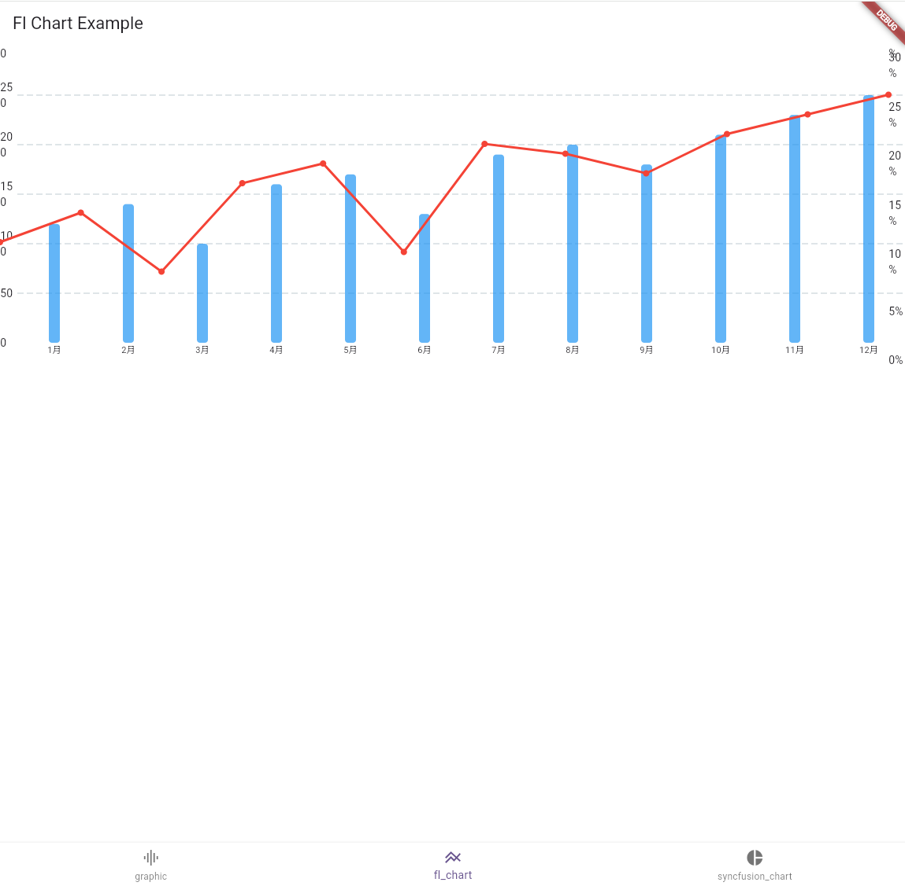
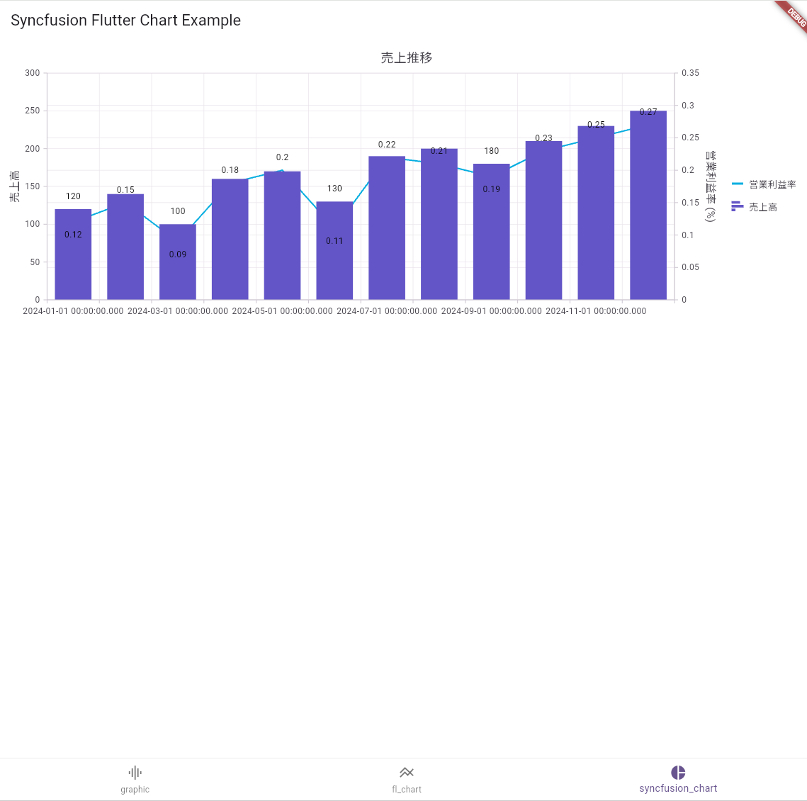

# Flutterで複合グラフ（Combination Chart）を作成する3つの方法

この記事は [Uzabase Advent Calendar 2025](https://qiita.com/advent-calendar/2025/uzabase) の11日目の記事です。

Flutterで棒グラフと折れ線グラフを組み合わせた「複合グラフ（Combination Chart）」を実装する方法について、3つの人気ライブラリを比較・検証するサンプルプロジェクトです。

## 概要

このサンプルでは、月ごとの「売上」を棒グラフで、「利益率」を折れ線グラフで表現する複合グラフを、以下の3つのライブラリを使って実装しています。

- [graphic](https://pub.dev/packages/graphic)
- [fl_chart](https://pub.dev/packages/fl_chart)
- [syncfusion_flutter_charts](https://pub.dev/packages/syncfusion_flutter_charts)

それぞれのライブラリでの実装方法や特徴を比較することができます。

## スクリーンショット

| graphic | fl_chart | syncfusion_flutter_charts |
| :---: | :---: | :---: |
|  |  |  |


## セットアップと実行方法

### 1. 前提条件

- Flutter SDK がインストールされていること。
  - インストール方法は [公式ドキュメント](https://docs.flutter.dev/get-started/install) を参照してください。

### 2. パッケージのインストール

プロジェクトのルートディレクトリで以下のコマンドを実行し、必要なパッケージをインストールします。

```bash
flutter pub get
```

### 3. アプリケーションの実行

以下のコマンドでアプリケーションをシミュレータまたは実機で実行します。

```bash
flutter run
```

アプリが起動すると、画面下部のボトムナビゲーションバーで各ライブラリのサンプルを切り替えることができます。

## 各ライブラリの実装解説

### 1. `graphic` (`lib/pages/graphic.dart`)

- **実装**: `Chart` ウィジェット内で、`IntervalMark`（棒グラフ）と `LineMark`（折れ線グラフ）を並べて記述するだけで複合グラフを表現できます。非常にシンプルで直感的な実装です。
- **特徴**: 異なる種類のグラフを組み合わせるのが容易です。文法が統一されているため、学習コストが低いかもしれません。

```dart
Chart(
  data: dummySalesData,
  variables: {
    // ... 変数の定義
  },
  marks: [
    IntervalMark(position: Varset("month") * Varset("sales")),
    LineMark(position: Varset("month") * Varset("profitRate")),
  ],
  axes: [Defaults.horizontalAxis, Defaults.verticalAxis],
)
```

### 2. `fl_chart` (`lib/pages/fl_chart.dart`)

デザイン性が高く、カスタマイズ性に富んだ人気のライブラリです。

- **実装**: `fl_chart`には直接的な複合グラフの機能がないため、`Stack`ウィジェットを使用して`BarChart`と`LineChart`を重ねて表示することで実現しています。
- **特徴**: 左右に異なるY軸（売上と利益率）を配置するなどの工夫が必要です。自由度が高い反面、複合グラフの実現には少し手間がかかります。

```dart
Stack(
  children: [
    _BarChart(), // 売上の棒グラフ
    _LineChart(), // 利益率の折れ線グラフ
  ]
)
```

### 3. `syncfusion_flutter_charts` (`lib/pages/syncfusion_chart.dart`)

Syncfusion社が提供する高機能な商用グレードのライブラリです（個人利用や小規模な組織では無料）。

- **実装**: `SfCartesianChart` ウィジェットの `series` プロパティに、`BarSeries` と `LineSeries` を追加することで複合グラフを作成します。
- **特徴**: 異なる単位を持つY軸を `axes` プロパティで簡単に追加できるなど、複雑な要件にも対応しやすい設計になっています。

```dart
SfCartesianChart(
  // ...
  axes: <ChartAxis>[
    NumericAxis(
      name: 'profitAxis', // 利益率用のY軸
      opposedPosition: true,
    ),
  ],
  series: <CartesianSeries<SalesData, String>>[
    LineSeries<SalesData, String>(
      // ...
      yAxisName: 'profitAxis', // 利益率のデータをprofitAxisに紐付け
    ),
    BarSeries(
      // ...
    ),
  ],
)
```

## まとめ

3つのライブラリはそれぞれ異なるアプローチで複合グラフを実装します。

- **手軽さ・シンプルさ**: `graphic`
- **デザイン・カスタマイズ性**: `fl_chart`
- **高機能・複雑な要件**: `syncfusion_flutter_charts`

プロジェクトの要件や開発者の好みに合わせて、最適なライブラリを選択する際の参考にしてください。

## ライセンス

This project is licensed under the MIT License.
